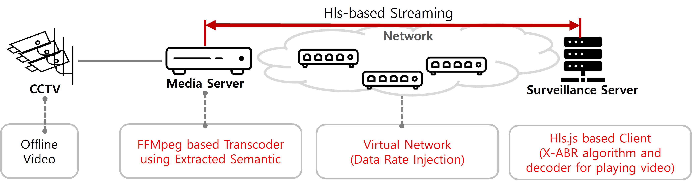

# DASS-Demo

<p align="center">



## OS and software preparation

We base our experimental environment on Ubuntu 24.04 LTS and highly recommend that you do the same. This streamlines the setup process and avoids unexpected issues caused by incompatible software versions etc. Please ensure that you have Python installed. Also make sure that you have root or sudo permission.


## Install Nginx and FFmpeg

1. Update and install libs.

```shell
sudo apt update
sudo apt upgrade -y 

sudo apt install -y build-essential libpcre3 libpcre3-dev libssl-dev zlib1g zlib1g-dev unzip
```

2. Change the current directory and use root access.

```shell
cd /usr/local/src 
su 
```

3. Download nginx-rtmp module and all dependencies for nginx-1.27.4

```shell
wget https://nginx.org/download/nginx-1.27.4.tar.gz  
wget https://github.com/arut/nginx-rtmp-module/archive/master.zip
```

4. Unzip downloaded files

```shell
tar -zxvf nginx-1.27.4.tar.gz 
unzip master.zip
```

5. Compile nginx with rtmp module

```shell
cd nginx-1.27.4 

./configure --add-module=../nginx-rtmp-module-master --with-http_ssl_module 

make 
make install
```

6. Make directory for streaming

```shell
mkdir -p /usr/local/nginx/html/stream/hls
```

7. Modify nginx.conf

Find IP address of nginx server.

Use its IP address as the 'server_name' in the 'nginx.conf' file in 'nginx' folder.
Substitue that file for 'nginx.conf' in '/usr/local/nginx/conf' directory.

8. Install FFmpeg

```shell
sudo apt update
sudo apt install ffmpeg
```

We used ffmpeg version 6.1.1. and highly recommend that you do the same.

## Install DASS-Demo/mediaServer


## Install DASS-Demo/surveillanceServer


## Setting DASS-Demo environment


## Running DASS-Demo with injected network trace

1. Run each nginx server in root access

```shell
su

/usr/local/nginx/sbin/nginx
```

2. Install Chrome Debugging Protocol interface for surveillanvce server

```shell
npm install chrome-remote-interface
```

3. Open Chrome tab for debugging in surveillanvce server

```shell
& "C:\Program Files\Google\Chrome\Application\chrome.exe" --remote-debugging-port=9222 --disable-popup-blocking --ignore-certificate-errors --user-data-dir="C:\temp\chrome-debug-new"
```

4. At debugging Chrome tab, move to surveillanvce server demo page by URL

Surveillance server demo page URL : http://{serverIP}/hls.js/demo/DASS-Demo.html

5. Inject network trace

```shell
wsl bash -c "cd /{runTrace.js Directory} && node runTrace.js"
```
Running file will automatically refresh the page with injected network trace.

## Contact
This page and files are still updating.

Jihoon Lim, Korea University, lim921211@korea.ac.kr

Goeun Park, Korea University, gopark@korea.ac.kr

